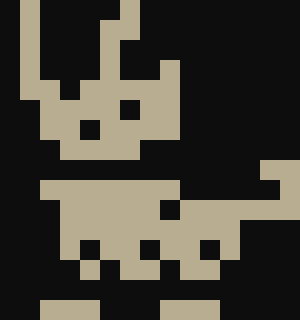

<p align="center">
    <a href="./pages.html">
        
    </a>
</p>

# Tour

Welcome to the Parin game engine tour.
This page will go over each feature of the engine and provide examples of how to use them.
If you notice anything missing or would like to contribute, feel free to create an [issue](https://github.com/Kapendev/parin/issues)!

## 1. Getting Started

This guide shows how to install Parin and its dependencies using [DUB](https://dub.pm/).
To begin, make a new folder and run inside the following commands to create a new project:

```cmd
dub init -n
dub run parin:setup
```

If everything is set up correctly,
there should be some new files inside the folder.
Three of them are particularly important:

* source: Contains the source code of the game.
* assets: Contains the assets of the game.
* web: Used for exporting the game to the web.

Additionally, an app.d file is inside the source folder that looks like this:

```d
import parin;

void ready() {
    lockResolution(320, 180);
}

bool update(float dt) {
    drawDebugText("Hello world!", Vec2(8));
    return false;
}

void finish() { }

mixin runGame!(ready, update, finish);
```

This code will create a window that displays the message "Hello world!".
Here is a breakdown of how it works:

1. The Ready Function

    ```d
    void ready() {
        lockResolution(320, 180);
    }
    ```

    This function is the starting point of the game.
    It is called once when the game starts and, in this example, locks the game resolution to 320x180.

2. The Update Function

    ```d
    bool update(float dt) {
        drawDebugText("Hello world!", Vec2(8));
        return false;
    }
    ```

    This function is the main loop of the game.
    It is called every frame while the game is running and, in this example, draws the message "Hello world!" at position (8, 8).
    The `return false` statement at the end indicates that the game should continue running.
    If `true` were returned, then the game would stop running.

3. The Finish Function

    ```d
    void finish() { }
    ```

    This function is the ending point of the game.
    It is called once when the game ends and, in this example, does nothing.

4. The Mixin

    ```d
    mixin runGame!(ready, update, finish);
    ```

    This mixin sets up a main function that opens a window and calls the ready, update and finish functions.
    By default, the window has a size of 960x540.

In essence, a Parin game typically relies on three functions:

* A ready function.
* An update function.
* A finish function.

To run the game, use the following command:

```cmd
dub run
```

## 2. Modules

Parin consists of the following modules:

* parin.engine
* parin.map
* parin.sprite
* parin.story
* parin.timer
* parin.ui

The `parin.engine` module is the only mandatory module for creating a game.
All other modules are optional and can be included as needed.
The `import parin;` statement in the example above is a convenience import that includes all modules.

## 3. Input

Parin provides a set of input functions inside the `parin.engine` module.
These include:

```d
bool isDown(char key);
bool isDown(Keyboard key);
bool isDown(Mouse key);
bool isDown(Gamepad key, int id = 0);

bool isPressed(char key);
bool isPressed(Keyboard key);
bool isPressed(Mouse key);
bool isPressed(Gamepad key, int id = 0);

bool isReleased(char key);
bool isReleased(Keyboard key);
bool isReleased(Mouse key);
bool isReleased(Gamepad key, int id = 0);

Keyboard dequeuePressedKey();
dchar dequeuePressedRune();

Vec2 wasd();
Vec2 wasdPressed();
Vec2 wasdReleased();

Vec2 mouse();
Vec2 deltaMouse();
float deltaWheel();
```

Below are examples showing how to use these input functions to move text.

* Using the Mouse

    ```d
    bool update(float dt) {
        drawDebugText("Text", mouse);
        return false;
    }
    ```

* Using the Arrow Keys

    ```d
    auto position = Vec2(8);

    bool update(float dt) {
        position.x += Keyboard.right.isDown - Keyboard.left.isDown;
        position.y += Keyboard.down.isDown - Keyboard.up.isDown;
        drawDebugText("Text", position);
        return false;
    }
    ```

* Using the WASD Keys

    ```d
    auto position = Vec2(8);

    bool update(float dt) {
        position.x += 'd'.isDown - 'a'.isDown;
        position.y += 's'.isDown - 'w'.isDown;
        drawDebugText("Text", position);
        return false;
    }
    ```

* Using the WASD or Arrow Keys

    ```d
    auto position = Vec2(8);

    bool update(float dt) {
        position += wasd;
        drawDebugText("Text", position);
        return false;
    }
    ```

## 4. Drawing

Parin provides a set of drawing functions inside the `parin.engine` module.
These include:

```d
void drawRect(Rect area, Color color = white);
void drawHollowRect(Rect area, float thickness, Color color = white);
void drawCirc(Circ area, Color color = white);
void drawHollowCirc(Circ area, float thickness, Color color = white);
void drawVec2(Vec2 point, float size, Color color = white);
void drawLine(Line area, float size, Color color = white);

void drawTexture(Texture texture, Vec2 position, DrawOptions options = DrawOptions());
void drawTextureArea(Texture texture, Rect area, Vec2 position, DrawOptions options = DrawOptions());
void drawTexturePatch(Texture texture, Rect area, Rect target, bool isTiled, DrawOptions options = DrawOptions());

void drawViewport(Viewport viewport, Vec2 position, DrawOptions options = DrawOptions());
void drawViewportArea(Viewport viewport, Rect area, Vec2 position, DrawOptions options = DrawOptions());

void drawRune(Font font, dchar rune, Vec2 position, DrawOptions options = DrawOptions());
void drawText(Font font, IStr text, Vec2 position, DrawOptions options = DrawOptions());
void drawDebugText(IStr text, Vec2 position, DrawOptions options = DrawOptions());
```

### Draw Options

Draw options are used for configuring drawing parameters.
The data structure looks like this:

```d
struct DrawOptions {
    Vec2 origin = Vec2(0.0f);
    Vec2 scale = Vec2(1.0f);
    float rotation = 0.0f;
    Color color = white;
    Hook hook = Hook.topLeft;
    Flip flip = Flip.none;
    Alignment alignment = Alignment.left;
    int alignmentWidth = 0;
    float visibilityRatio = 1.0f;
    bool isRightToLeft = false;
}
```

Here is a breakdown of what every option is:

* origin: The origin point of the object.
* scale: The scale of the object.
* rotation: The rotation of the object, in degrees.
* color: The color of the object, in RGBA.
* hook: A value representing the origin point of the object when origin is zero.
* flip: A value representing flipping orientations.
* alignment: A value represeting alignment orientations.
* alignmentWidth: The width of the aligned object.
* visibilityRatio: The visibility ratio of the object, between 0.0 and 1.0.
* isRightToLeft: A flow indicator for things such as Arabic or Hebrew text.

Below are examples showing how to use these options to change how text looks.

* Changing the Alignment

    ```d
    bool update(float dt) {
        auto options = DrawOptions(Alignment.right);
        drawDebugText("Hello.\nThis is some text.", Vec2(8), options);
        return false;
    }
    ```

* Changing the Size and Origin

    ```d
    bool update(float dt) {
        auto options = DrawOptions(Hook.center);
        options.scale = Vec2(4 + sin(elapsedTime * 4));
        drawDebugText("Text", resolution * Vec2(0.5), options);
        return false;
    }
    ```

## 5. Sound

Parin provides a set of sound functions inside the `parin.engine` module.

```d
void playSound(Sound sound);
void stopSound(Sound sound);
void pauseSound(Sound sound);
void resumeSound(Sound sound);
void updateSound(Sound sound);
```

## 6. Loading and Saving Resources

Parin provides a set of loading and saving functions inside the `parin.engine` module.
These include:

```d
TextureId loadTexture(IStr path);
FontId loadFont(IStr path, int size, int runeSpacing, int lineSpacing, IStr32 runes = "");
FontId loadFontFromTexture(IStr path, int tileWidth, int tileHeight);
SoundId loadSound(IStr path, float volume, float pitch);

Result!Texture loadRawTexture(IStr path);
Result!Font loadRawFont(IStr path, int size, int runeSpacing, int lineSpacing, IStr32 runes = "");
Result!Font loadRawFontFromTexture(IStr path, int tileWidth, int tileHeight);
Result!Sound loadRawSound(IStr path, float volume, float pitch);

Fault loadRawTextIntoBuffer(IStr path, ref LStr buffer);
Result!LStr loadRawText(IStr path);
Result!IStr loadTempText(IStr path);
Fault saveText(IStr path, IStr text);
```

Functions that start with the word load or save will always try to read/write resources from/to the assets folder.
They handle both forward slashes and backslashes in file paths, ensuring compatibility across operating systems.
Additionally, resources are deviced into three groups. Managed, raw and temporary.

### Managed Resources

Managed resources are cached by their path they were loaded with.
To free these resources, use the `freeResources` function or the `free` method on the resource identifier.
The resource identifier is automatically invalidated when the resource is freed.

### Raw Resources

Raw resources are managed directly by the user and are not cached.
They must be freed manually when no longer needed.

### Temporary Resources

Temporary resources are only valid until the function that provided them is called again.
They don’t need to be freed manually.

## 7. Sprites and Tile Maps

Sprites and tile maps can be implemented in various ways.
To avoid enforcing a specific approach, Parin provides optional modules for these features, allowing users to include or omit them as needed.
Parin provides a sprite type inside the `parin.sprite` module and a tile map type inside the `parin.map` module.

<br>
Links:
[Pages](./pages.html)
[GitHub](https://github.com/Kapendev/parin)
[X](https://x.com/Kapendev)
[Bluesky](https://bsky.app/profile/kapendev.bsky.social)
[Itch](https://kapendev.itch.io/)
